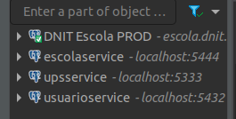

# Banco de dados

Portas, nomes de banco de dados ou de conteineres devem ser obtidos a partir de
cada `docker-compose.yml` dos serviços.

`<nome-do-container-do-banco>` pode ser `dnit-usuario-db`, `dnit-escola-db`
ou `dnit-ups-db`.

`<nome-do-database>` pode ser `usuarioservice`, `escolaservice` ou `upservice`.


## Acessando pelo PgAdmin em container Docker

Não é obrigatório executar UsuarioService pelo docker. Ainda assim, é 
necessário que o docker crie a rede usada pelos bancos de dados dos containeres
dos outros serviços. Para criar a rede, você pode iniciar apenas os containeres
do pgadmin e do banco de dados:

```sh
docker compose up -d <nome-do-container-do-banco> pgadmin 
```

Então você vai poder acessar um cliente PostgreSQL em http://localhost:5555.
Use o **email** `dnit@fga.com` e a **senha** `fga1234` para fazer login.

Para criar uma conexão com o banco de dados use as seguintes informações:

- Host: `<nome-do-container-do-banco>`
- Porta: 5432
- Database: `<nome-do-database>`
- Senha: 1234

`<nome-do-database>` pode ser `usuarioservice`, `escolaervice` ou `upsservice`.

## Acessando por um cliente PostgreSQL nativo

Instale o [Postbird](https://github.com/Paxa/postbird#download)
ou o [DBeaver](https://dbeaver.io/download/).

Para criar uma conexão com o banco de dados use as seguintes informações:

- Host: localhost
- Porta: `porta`
- Database: `<nome-do-database>`
- Senha: 1234

A `porta` é especificada em cada `docker-compose.yml` dos serviços.

## Dicas gerais

Pode ser que você queira criar uma conexão com o banco de dados em produção.
Se esse for o caso, deixe explícito:



Assim você reduz as chances de executar queries no banco errado.